# **This is [Jashshor]([jashshor.fun](https://jashshor.fun/)) 🙋🏻‍♂️**

- 📖 *BSC* in *Communication Engineering Specialty*, *Xidian University*
- 🏢 Software Engineer in Tencent
- 🎛️ What I can use:
  - C/Cpp
  - Objective-C
  - Matlab
  - And little about Python/Java/Verilog/ASM
- 📺 Fond of Animations Moving and inspirational
- 🏸 Interested in badminton
